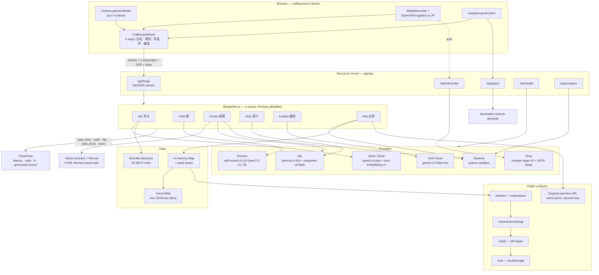
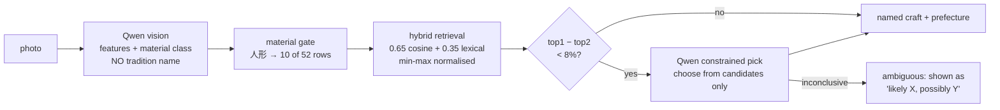

# 継 TSUGI — architecture

One photograph and one spoken memo become a live, four-language storefront for a piece of
Japanese craft in about 15 seconds. Six sponsored products sit on that path, each doing the
one job it is actually best at.

---

## 1. The whole system in one picture

---

## 2. The six stages and who runs them

Stages inside a wave run concurrently. A `step_fail` never aborts the run — it degrades.

| Wave | Stage | Provider | What actually happens |
|---|---|---|---|
| 1 | `see` 見る (`pipeline.ts:119`) | **Qwen Cloud** | One vision pass over photo 1. Returns a material class plus observed features. **Forbidden from naming a tradition.** |
| 1 | `mark` 銘 (`mark.ts:11`) | **Nosana** | Reads 落款・銘・箱書き off the same photo on our own GPU. |
| 2 | `comps` 相場 (`pipeline.ts:239`) | **ai& + Daytona** | ai& writes a Python parser; Daytona executes it over marketplace HTML; we compute the price band. |
| 2 | `story` 語り (`pipeline.ts:332`) | **ai&** | All Japanese authoring: 箱書き, story, care, and the family-history paragraph. |
| 3 | `localize` 翻訳 (`pipeline.ts:372`) | **GMI Cloud** | Four concurrent calls, one per language. Localisation, not translation. |
| 4 | `ship` 出荷 (`pipeline.ts:427`) | **Daytona** | Assembles the `Piece`, writes to store + Blob, mirrors the page inside the sandbox. |

Measured golden run: **~15 s, 8 provider calls, ≈¥0.5**, streamed live to the trace pane.

---

## 3. Where each sponsor lives in the code

### ai& — all Japanese generation, plus the scraper codegen
`lib/providers.ts:13` · `lib/pipeline.ts:332-370` (story) · `lib/pipeline.ts:239-300` (codegen)
Two models on one Japanese endpoint: `google/gemma-4-31b-it` authors, `deepseek-v4-flash`
writes the Python. Every token about an artisan's technique stays on Japanese infrastructure,
and the trace pane's cost line is that argument made visible.

### Qwen Cloud — perception and retrieval embeddings
`lib/pipeline.ts:119-223` (see + `pickCandidate`) · `lib/crafts.ts:127-133`
`qwen3-vl-plus` for `see`, plus one constrained tie-break call when the retrieval margin is
under 8%. `text-embedding-v4` embeds the craft index when Nosana's embedding model is unset.

### Nosana — own GPU, Japanese seal script
`lib/mark.ts:11-35` · `lib/crafts.ts:115-121`
A self-hosted vLLM `Qwen2.5-VL-7B-Instruct` node. No hosted API reads 篆書 well; this one is
ours and it is the only stage whose budget is GPU-hours rather than tokens.

### Daytona — untrusted code, untrusted HTML, second host
`lib/sandbox.ts` (whole file) · `lib/comps.ts` · `lib/pipeline.ts:239-330`, `427-465` · `/api/prewarm`
The agent writes a parser at request time and we run code we have never seen over ~1 MB of
marketplace HTML. Neither the code nor the HTML touches the app server. The sandbox then
serves the finished storefront as a second live URL. Sandboxes auto-stop at 10 idle minutes
and delete on stop, because the account disk cap is 30 GiB.

### GMI Cloud — the four-language fan-out
`lib/providers.ts:29` · `lib/pipeline.ts:372-425`
Exactly four concurrent calls per run, EN / 中文 / FR / 한국어, each naming why *that* market
recognises the price, and each carrying the artisan's spoken family history.

### Qoder — dev-time
This repository was written through Qoder in the build window. No runtime key, by design.

### Disclosed, not claimed
**Groq** does two honest jobs: `whisper-large-v3` in `/api/transcribe` (browser dictation
only exists in Chromium, so Safari and Firefox would otherwise capture audio with no text),
and a JSON repair pass in `lib/llm.ts:93`. It never serves a golden-path stage.
**Vercel Blob** persists one JSON per piece so stores survive a cold lambda (`lib/storage.ts`).
**Google Maps** renders the workshop when `NEXT_PUBLIC_GOOGLE_MAPS_API_KEY` is set, with
OpenStreetMap as the keyless fallback; reverse geocoding is Nominatim (`lib/place.ts`).

---

## 4. Grounded identification — why `see` may not name anything

Black lacquer from Echizen, Wajima, Yamanaka and Kishu is indistinguishable in a photograph.
Ask a vision model "what is this?" and it answers with the most famous name it knows. That
failure is systematic, and since region drives workshop, price and story, one bad guess makes
everything downstream confidently wrong.

Three moves: perception is separated from naming, the declared material class gates the
candidate pool (`lib/crafts.ts:33-49`), and ties are broken by a single constrained call that
may only choose from retrieved candidates. Measured effect: painted wooden kokeshi went from
九谷焼 (a porcelain kiln) to 宮城伝統こけし, 宮城県.

---

## 5. Data flow for one piece

1. **Wizard** collects shop name, GPS, up to four photos, and two spoken notes — technique
   and family history — with live captions in Chromium and a Whisper transcript on stop.
2. **`/api/forge`** streams NDJSON: `step_start` → `code` → `log` → `step_done` per stage,
   then one `done` carrying the whole `Piece`.
3. **`ship`** writes the piece to an in-memory `Map` and to Vercel Blob, mirrors it into the
   Daytona sandbox, and returns `/market/store/{slug}`.
4. **Buyer surfaces** read the same store: `/market` lists every workshop, the store page
   shows the piece with map, audio and four languages, `/s/{id}` is the QR target, and
   `/cart` is a localStorage basket with no account and no payment.

## 6. Failure behaviour

| If this dies | What the buyer sees |
|---|---|
| Qwen `see` | Falls back to `seed.vision`; run continues |
| Nosana `mark` | Provenance column omitted, `step_fail` shown honestly |
| Daytona `comps` | Generated code still displayed, band marked as a reference value |
| ai& `story` | Groq JSON repair, then seed story |
| GMI `localize` | Seed copy per failed language; the others still render |
| Blob | Piece stays in the warm instance's memory |
| Everything | `/s/demo` and the seven seed stores are always live |
